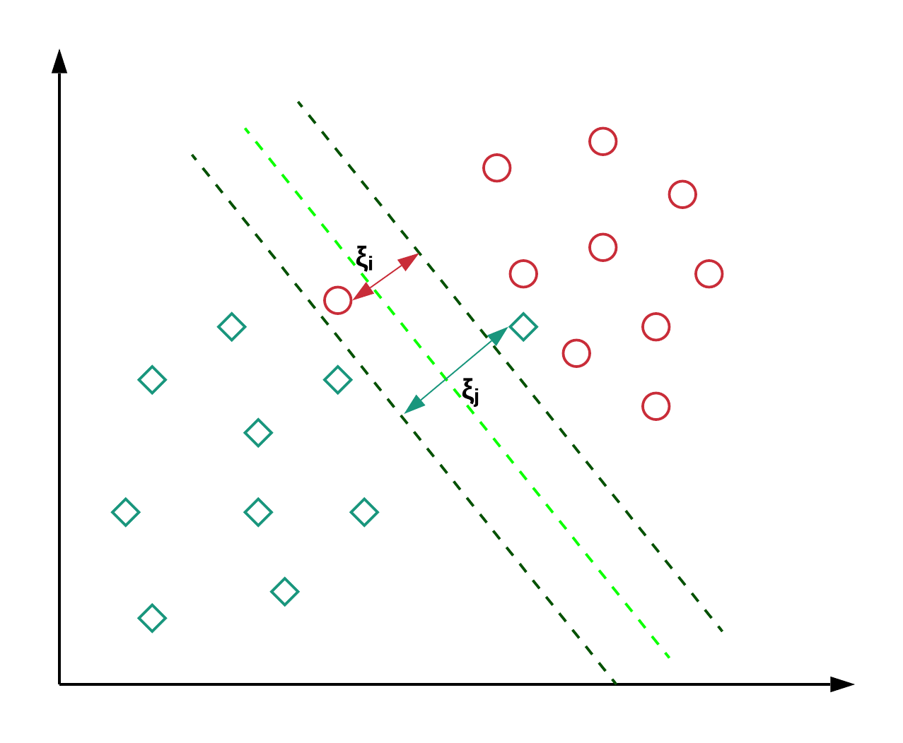
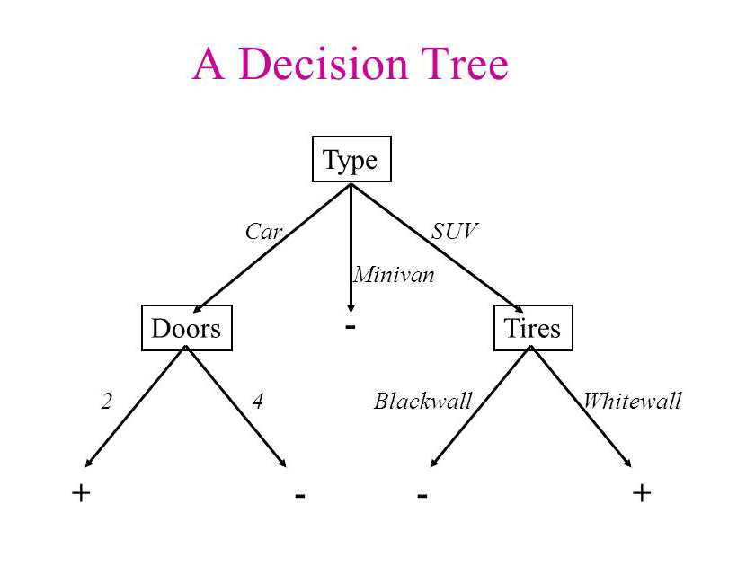
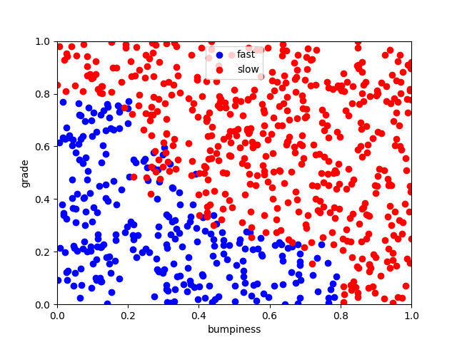

# Udacity Data Analyst Nanodegree
## P8: Introduction to Machine Learning
---
October 2, 2019
Preston Hall


## Context

This repo hold my machine learning projects that I have completed or currently working on through Udacity's Data Analysis Nanodegree program. 

## Machine learning algorithms 

### Naive Bayes
> A family of simple ["probabilistic classifiers"](https://en.wikipedia.org/wiki/Probabilistic_classification) based on applying Bayes theorem with strong independence assumptions between features. 

###### Importing Naive Bayes from Scikit

 ```python
from sklearn.naive_bayes import GaussianNB

clf = GaussianNB() 
clf.fit(X, Y)    
pred = clf.predict(x)
accuracy = clf.score(x, y)

 ```

 ### Support Vector Machines (SVM)

 > Support-vector machines (SVMs, also support-vector networks) are [supervised learning](https://en.wikipedia.org/wiki/Supervised_learning) models with associated learning algorithms that analyze data used for classification and regression analysis. 



 ###### Importing SVC from Scikit

```python
from sklearn.svm import SVC

clf = SVC(kernel="rbf", C=10000, gamma='scale')
clf.fit(X, Y)    
pred = clf.predict(x)
accuracy = clf.score(x, y)
```

### Decision Tree Regression

> A decision tree is a decision support tool that uses a tree-like graph or model of decisions and their possible consequences, including chance event outcomes, resource costs, and utility. It is one way to display an algorithm that only contains conditional control statements.



**Entropy:** Controls how the DT decides where to split the data. measure of impuity in a bunch of examples. An Entropy of 1.0 is maximally impure state

**Biase-Variance dilemma:** The conflict in trying to simultaneously minimize these two sources of error that prevent supervised learning algorithms from generalizing beyond their training set: The bias error is an error from erroneous assumptions in the learning algorithm. 

#### Importing DecisionTree from Scikit

```python
from sklearn import tree

clf = tree.DecisionTreeClassifier(min_sample_split=2)
clf = clf.fit(X, Y)
pred = clf.predict(x)
accuracy = clf.score(x, y)
```

---

### Choose your own Algorithm

For this next mini-project, choose from the following algorithms to resaerch,  deploy, use it to make predictions, and evaluate results.

- **K Nearest Neighbor:** In pattern recognition, the k-nearest neighbors algorithm (k-NN) is a non-parametric method used for classification and regression. In both cases, the input consists of the k closest training examples in the feature space.
<br>

- **Adaboost:** Short for Adaptive Boosting, is a machine learning meta-algorithm formulated by Yoav Freund and Robert Schapire, who won the 2003 Gödel Prize for their work. It can be used in conjunction with many other types of learning algorithms to improve performance.
<br>

- **Random Forest:** Random forests or random decision forests are an ensemble learning method for classification, regression and other tasks that operates by constructing a multitude of decision trees at training time and outputting the class that is the mode of the classes or mean prediction of the individual trees.

I am going to use Random Forest from my Algorithm. 

 ###### Importing Random Forest from Scikit

```python
from sklearn.ensemble import RandomForestClassifier

clf = tree.RandomForestClassifier()
clf = clf.fit(X, Y)
pred = clf.predict(x)
accuracy = clf.score(x, y)
```
Optional parameters:
- n_estimators: number of trees in the forrest

The script ran very quick and smooth. Using the prettyPicture() output the following graph. 



---

## Exploring Enron Corpus Dataset

Types of data you can encounter when using ML
- Numerical: Numerical values (numbers)
- Categorical: Limited number of discrete values (category)
- Time Series: Temporal Value (Date, Timestamp)
- Text: Words (can be converted to numbers)

---

### LinearRegression

In statistics, linear regression is a linear approach to modeling the relationship between a scalar response (or dependent variable) and one or more explanatory variables (or independent variables). The case of one explanatory variable is called simple linear regression. For more than one explanatory variable, the process is called multiple linear regression.


```python
from sklearn.linear_model import LinearRegression
### reg = Regression
reg = LinearRegression()
reg.fit(X, y) 
reg.score(X, y) # returns the R-squared score. Compare R-squared test to R-squared training data.
reg.predict([]) # Takes a list of at least one item and predicts the outcome. 
reg.intercept_ # returns the y-intercept
reg.coef_ # returns the slope


```

R-squared: A statistical measure that represents the proportion of the variance for a dependent variable that's explained by an independent variable or variables in a regression model. 

##### Linear Regression Errors
The actual value vs the predicted value. 

- ###### Sum of Squares Error
Minimizing the sum of squares error (SSE)
Ordinary Least Squares (OLS) - What SKlearn uses
Gradient Descent - (not used in this class)

* There can be mulitple lines that minimize $\sum|error|$, but only one line will minimize $\sum|error^2|$. This is why we use the squared sum. 
Using SSE makes the implementation much easier as well. 

Problems with SSE: Typically Large SSE equal a worse fit. But great data points, which is usually better, will increase the SSE. Makes it hard to compare two different sets of data. 

- ###### $ r^2 $ ("r squared") of a regression
Does not have the same shortcoming as SSE. 

Returns a value  $ 0.0 < r^2 < 1.0 $ where 0.0 is not really capturing the data well.

Independant from the number of training points. 

> Note that R2 is only bounded from below by 0 when evaluating a linear regression on its training set. If evaluated on a significantly different set, where the predictions of a regressor are worse than simply guessing the mean value for the whole set, the calculation of R2 can be negative.

View the graph with Matplotlib
```python

plt.scatter(x_value, y_value)
plt.plot(x_value, reg.predict(x_value), color='blue', linewidth=3)
plt.xlabel("Title")
plt.ylabel("Other Title")
plt.show()
```

##### Classification vs Regression

| Property | Supervised Classification | Regression|
|---|---|---|
| Output Type | Discreet (class labels) | continuous (number) | 
| What are you trying to find? | decision (boundary) |  "best fit" line |
| Evaluation | accuracy | SSE or $ r^2 $ (r squared) |

##### Multivariate Regressions

A method used to measure the degree at which more than one independent variable (predictors) and more than one dependent variable (responses), are linearly related.

### Outliers

There is data that is going to pull the regression and lower the score. 
Remove all NaN's and outliers

# Unsupervisoed Machine Learning


k-means: k-means clustering is a method of vector quantization, originally from signal processing, that is popular for cluster analysis in data mining. Works in 2 stpes
1. Assign
2. Optimize
3. Repeat

[Visual Aid](https://www.naftaliharris.com/blog/visualizing-k-means-clustering/)

[Sklearn KMeans Documentation](https://scikit-learn.org/stable/modules/generated/sklearn.cluster.KMeans.html#sklearn.cluster.KMeans)


### Feature Scaling

Feature scaling is a method used to normalize the range of independent variables or features of data. In data processing, it is also known as data normalization and is generally performed during the data preprocessing step.


$ x^1 = \frac{x - x_{min}}{x_{max} - x_{min}} $

Scaling features to a range using minmaxScaling with sklearn


from sklearn.preprocessing import MinMaxScaler
import numpy as np
X_train = np.array([[ 1., -1.,  2.],
                   [ 2.,  0.,  0.],
                    [ 0.,  1., -1.]])

scaler = MinMaxScaler()
rescaled_X_train = scaler.fit_transform(X_train)
X_scaled                                          


### Dimensions when Learning From Text


Bag of words: The bag-of-words model is a simplifying representation used in natural language processing and information retrieval. In this model, a text is represented as the bag of its words, disregarding grammar and even word order but keeping multiplicity. The bag-of-words model has also been used for computer vision.

Low-information words: words that appear in almost every set of text and so doesn't mean anything. Stop words are words that need to be removed completely as it appears too frequently, like 'the', 'in', 'a' and 'and'.

NLTK - National Language Tool Kit. 

To use stopwords for this first time, download the corpus. 

```python
import nltk

nltk.download()
```

```python
from nltk.corpus import stopwords

sw = stopwords.words("english")
```

There is a way to bundle similar words to count as one word. Use a stemmer to do this. 
e.g. [responsive, respond, responsive, repond] -> respon

#### Stemming with NLTK

```python
from nltk.stem.snowball import SnowballStemmer
# There are several types of stemmers

stemmer = SnowballStemmer("english")

#examples
stemmer.stem("Responsiveness")
>>> u'respon'
stemmer.stem('responsitivity')
>>>u'respon'
stemmer.stem('unresponsive')
>>>u'unrespon'
# there are certain limitations to this type of stemmer. This might be good or bad depending on what you're looking for. 
```

##### TfIdf Frequency

Tf = Term Frequency (like bag-of-words)
Idf = Inverse Document Frequency (the word gets a weighting to words that have a rare occurance)


## Feature Selection

There are several go-to methods of automatically selecting your features in sklearn. Many of them fall under the umbrella of univariate feature selection, which treats each feature independently and asks how much power it gives you in classifying or regressing.

There are two big univariate feature selection tools in sklearn: SelectPercentile and SelectKBest. The difference is pretty apparent by the names: SelectPercentile selects the X% of features that are most powerful (where X is a parameter) and SelectKBest selects the K features that are most powerful (where K is a parameter).

A clear candidate for feature reduction is text learning, since the data has such high dimension. We actually did feature selection in the Sara/Chris email classification problem during the first few mini-projects; you can see it in the code in tools/email_preprocess.py .


Bias-Variance Dilemma and No. of Features

High Bias - pays little attention to data oversimplication
     - High error on training set
High variance - pays too much attention to data (does not generalize well) overfits 
     - Much higher error on test set than on training set

How many features so that it falls in the middle of these two. 

THis is called regularization

Using Lasso for regression in sklearn

```python 
import sklearn.linear_model.Lasso

features, lables = GetMyData()
regression = Lasso()
regression.fit(features, labels)
regression.predict([2,4])
print(regression.coeff_)  # any 0.0 values means it will not use that feature
```

